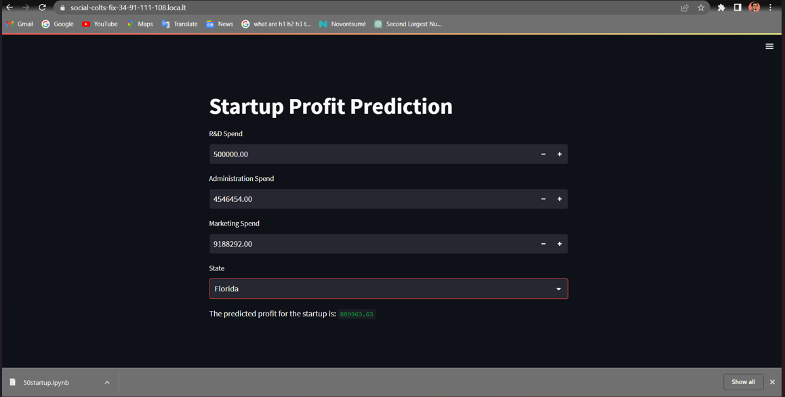

**Startup Profit Prediction** app:

```markdown
# 💼 Startup Profit Prediction with Machine Learning 🏦💻

This project helps predict **startup profits** using key features like **R&D Spend**, **Administration Spend**, and **Marketing Spend**. It even considers the **state** of operation to make precise predictions! Let’s go through the steps. 🚀

## 📊 Step 1: Data Loading & Overview
We use data from a `.csv` file that contains startup information. This includes:

- 🛠️ **R&D Spend** (How much is spent on research and development)
- 🏢 **Administration Spend**
- 📢 **Marketing Spend**
- 🌍 **State** (California, Florida, or New York)
- 💰 **Profit** (The target variable)

## 🔍 Step 2: Data Exploration
Before jumping into model training, let’s explore the data!

### Check for null values and summary statistics:

```python
data.describe()
data.isnull().sum()
```

### 🔥 Correlation Visualization:
We use a **heatmap** to understand the relationships between the variables:

```python
sns.heatmap(data.corr(), annot=True)
plt.show()
```

## 🧠 Step 3: Model Building & Training
We’re using a **Linear Regression model** to predict profits. Here's what we do:

1. 🔄 **Encode** the categorical variable (State) using **OneHotEncoder**.
2. 🎓 **Train the model** with training data.

```python
regressor.fit(X_train, y_train)
```

## ⚖️ Step 4: Predictions & Model Performance
We predict the **profits** on the test data and compare the **actual** vs **predicted** results:

```python
df = pd.DataFrame({'Actual': y_test, 'Predicted': y_pred})
```

To evaluate how well our model performs, we calculate the **R-squared** value:

```python
r2_score(y_test, y_pred)
```

## 📈 Step 5: Visualization
We visualize:

- **Predicted vs Actual Profits**:
  ```python
  plt.scatter(y_test, y_pred)
  plt.show()
  ```
  
- **R&D Spend vs Profit**:
  ```python
  sns.scatterplot(x=data['R&D Spend'], y=data['Profit'])
  plt.show()
  ```

## 🖥️ Step 6: Web App Using Streamlit 🎉
We built an interactive **Streamlit** app that allows users to input their own **spend values** and select the **state** to predict the startup's profit.

### Inputs:
- **R&D Spend** 🛠️
- **Administration Spend** 🏢
- **Marketing Spend** 📢
- **State** 🌍

### Outputs:
The app predicts the **profit** 💰 based on the user's input:

```python
prediction = model.predict(np.concatenate(([[rd_spend, admin_spend, marketing_spend]], state_encoded), axis=1))
```

You can access the **Startup Profit Prediction App** and try it out! 🚀

## 📸 Screenshot of the Web App:
Here’s how the app looks:



---

## 🎉 Conclusion:
With a few lines of code and machine learning, we built a simple yet powerful **startup profit prediction tool** that helps estimate profits based on key business spending data! 💡💸

---
